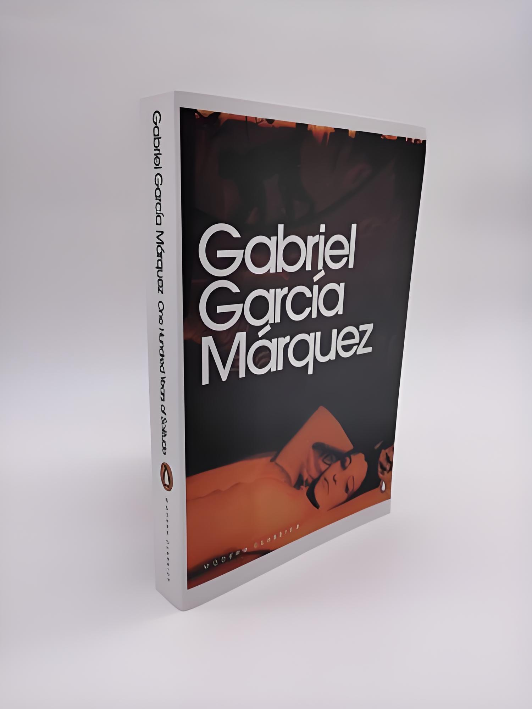

# 百年孤独
哥伦比亚作家加西亚·马尔克斯代表作  
作品描写了布恩迪亚家族七代人的传奇故事，以及加勒比海沿岸小镇马孔多的百年兴衰，反映了拉丁美洲一个世纪以来风云变幻的历史。作品融入神话传说、民间故事、宗教典故等神秘因素，巧妙地糅合了现实与虚幻，展现出一个瑰丽的想象世界，成为20世纪重要的经典文学巨著之一  

  

加西亚·马尔克斯  

  

## 为什么要翻译百年孤独
市面上百年孤独中文版有很多，完全没必要自己去翻译，为什么呢？

是的，这是一个浪费时间的工程，但是我在此寻找快乐

百年孤独是我阅读的第一本外国名著。从高中开始，我就有很好的文学阅读习惯，但是我把所有的阅读时间都放在了自己偏爱的中国古典诗词上面，大学四年我在图书馆阅读完了从东晋至近代所有能借阅的诗词类书籍，（如：全唐诗，宋诗/词大辞典，元/明/清诗大辞典）每一本都是浩瀚的阅读量，这让我在诗词的写作与鉴赏上大有进益。

当然，我深知自己的阅读面太过于狭隘，需要突破，于是我选择从外国名著下手。

我搜索了诺贝尔文学奖历届得主及其代表作，最终选择了从百年孤独开始，这是一个很好的开端，至今这仍是我最喜欢的外国名著。

最喜欢的当然是红楼梦啦😄😄😄

为什么要翻译百年孤独？

我不喜欢英语，我的英语很差，我们是从初一开始接触学习英语的，第一个英语老师过于严苛，加上自己跟不上，导致整个学生时代我都不喜欢英语，排斥英语

百年孤独，我太喜欢它了，喜欢里面的故事与人物，喜欢作者的写作手法与修辞。

两者对冲一下，希望能挥散学生时代挥之不去的阴影

原版是西班牙文，翻译时我会参考西班牙文版本